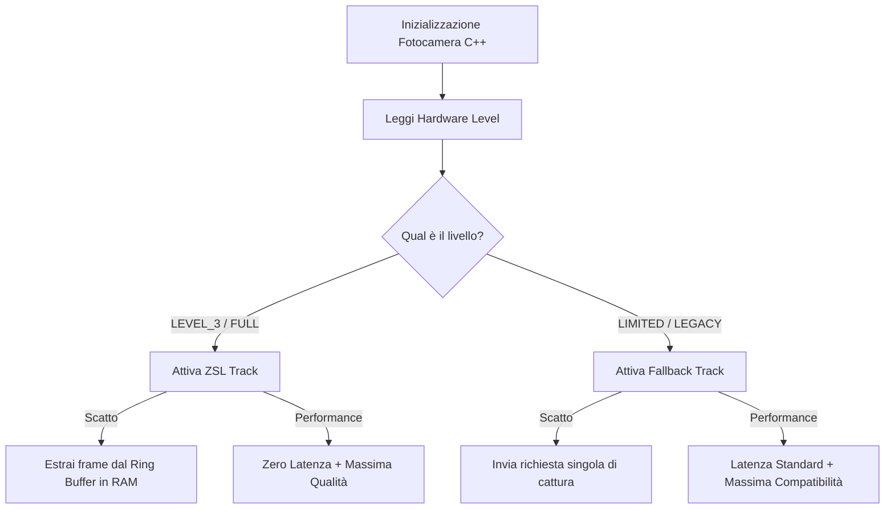

# 02. Abbandono di Kotlin: Full C++ Camera2 (NDK)

## 1. Problema Attuale & Obbiettivo di Performance
Attualmente, Kotlin si occupa di orchestrare il ciclo di vita dell'API fotocamera (`CameraEngine.kt`) e inoltrare i frame al motore grafico in C++ tramite `SurfaceTexture` o `AHardwareBuffer`. Questo introduce overhead di overhead di contesto (JNI context switching continuo durante la preview), latenza dello shutter e micro-stutter dovuti alla garbage collection ed all'assenza di un controllo preciso sui frame della fotocamera.

**Obiettivi di performance del nuovo modulo:**
- **Zero Shutter Lag (ZSL):** Latenza di cattura effettiva inferiore a 10ms su dispositivi compatibili catturando da un buffer circolare lock-free in memoria.
- **VSync Alignment:** Utilizzo di `AChoreographer` in C++ per allineare l'acquisizione dei frame di preview alla frequenza di aggiornamento del display hardware.
- **Zero-Copy Pipeline:** Elaborazione GPU diretta ed encoding JPEG nativo senza spostamenti di byte tra lo spazio C++ e la JVM.

---

## 2. Architettura a Doppio Binario (Graceful Degradation)
Per supportare la frammentazione del parco dispositivi Android senza compromettere le prestazioni sui modelli di fascia alta, implementiamo un sistema di **Graceful Degradation** basato sul livello hardware del sensore rilevato tramite la chiave metadata `ANDROID_INFO_SUPPORTED_HARDWARE_LEVEL`.



- **ZSL Track (`LEVEL_3` / `FULL`):** Configurazione contemporanea di preview OpenGL ed un target `AImageReader` YUV ad alta risoluzione. Un thread nativo dedicato alimenta un `RingBufferZsl` circolare preallocato. Al click dello scatto, viene estratto il frame in memoria più vicino al timestamp del tap.
- **Fallback Track (`LIMITED` / `LEGACY`):** Viene inizializzato solo il canale di preview per non sovraccaricare la memoria RAM. Al momento dello scatto, viene inviata una richiesta singola di cattura ad alta risoluzione (non-ZSL), garantendo la massima compatibilità e stabilità.

---

## 3. Ottimizzazioni Tecniche e Dettagli JNI

### Flusso Zero-Copy per Elaborazione e Salvataggio
Per evitare picchi nell'uso della memoria Heap JVM e minimizzare la latenza:
1. L'engine C++ ottiene l'immagine in ingresso sotto forma di `AHardwareBuffer` tramite `AImage_getHardwareBuffer`.
2. Il buffer viene processato in C++ tramite **Filament** applicando gli shader d'effetto (Uber Shader) in modo zero-copy e renderizzato su un `AHardwareBuffer` di output.
3. Il puntatore all'output buffer viene passato a Kotlin come `HardwareBuffer` nativo (disponibile a partire da API 29).
4. Kotlin avvolge direttamente il buffer in un oggetto `Bitmap` (`Bitmap.wrapHardwareBuffer`) e usa l'encoder nativo ottimizzato `Bitmap.compress` per salvare l'immagine finale nel MediaStore come JPEG.

### Conservazione dei Metadati EXIF
Dato che `AImageReader` in formato YUV raw non genera automaticamente metadati EXIF preconfezionati, implementiamo un ponte efficiente:
1. In C++, al momento dello scatto estraiamo i metadati fisici associati al frame dal sensore (`ACameraMetadata` associato a `AImage`).
2. Tramite JNI, convertiamo i parametri rilevanti (ISO, tempo di esposizione, lunghezza focale, apertura) in una mappa key-value passata a Kotlin.
3. Il modulo Kotlin `ExifMetadataManager.kt` si occupa di scrivere i metadati nel file finale JPEG utilizzando la libreria di sistema `ExifInterface`, evitando di importare ed esporre librerie C++ esterne (es. `libexif`).

### Rotazione e Specchiamento (Mirroring) GPU
La compensazione dell'orientamento del sensore (`ACAMERA_SENSOR_ORIENTATION`) e il mirroring per la fotocamera frontale non vengono delegati alla CPU o ad elaborazioni bitmap successive:
- La matrice di rotazione/specchiamento viene calcolata ed iniettata direttamente nella pipeline di rendering GPU di **Filament**, ruotando i vettori delle coordinate texture in fase di rasterizzazione.

### Proguard Rules per JNI (Prevenzione NoSuchMethodError)
Nelle build di produzione (Release), Proguard/R8 rimuove i callback in Kotlin che sono richiamati esclusivamente dal C++ via riflessione JNI. Per evitare crash a runtime, aggiorniamo `proguard-rules.pro` per preservare l'interfaccia esposta:
```proguard
-keep class com.grovkornet.nativefilmcamera.ui.NativeFilmCameraView { *; }
-keep class com.grovkornet.nativefilmcamera.logic.ExifMetadataManager { *; }
```

---

## 4. Mappatura delle Modifiche del Codice

### 4.1. Nuovi Componenti in C++ (`packages/engine/android`)

- **[CMakeLists.txt](file:///c:/Users/alexg/Documents/grovkornet/packages/engine/android/CMakeLists.txt):**
  - Integrazione delle librerie NDK native `camera2ndk` e `mediandk` tramite `find_library` e `target_link_libraries`.
  - Inclusione dei file sorgente di seguito elencati per la build principale e i test C++.
- **[NdkCameraManager.cpp](file:///c:/Users/alexg/Documents/grovkornet/packages/engine/android/src/main/cpp/camera/NdkCameraManager.cpp) / `.h`:**
  - Scoperta, enumerazione dei sensori fisici e interrogazione delle capabilities hardware.
- **[NdkCaptureSession.cpp](file:///c:/Users/alexg/Documents/grovkornet/packages/engine/android/src/main/cpp/camera/NdkCaptureSession.cpp) / `.h`:**
  - Gestione degli stati di `ACameraDevice` e `ACameraCaptureSession`. Configurazione dinamica dei target OpenGL Surface e `AImageReader`.
- **[RingBufferZsl.cpp](file:///c:/Users/alexg/Documents/grovkornet/packages/engine/android/src/main/cpp/camera/RingBufferZsl.cpp) / `.h`:**
  - Buffer circolare preallocato lock-free con push automatico e riciclo dei frame `AImage` obsoleti.

### 4.2. Rimozione di File Obsoleti in Kotlin
La logica di orchestrazione fotocamera su CameraX viene completamente rimossa:
- **[DELETE] [CameraSessionManager.kt](file:///c:/Users/alexg/Documents/grovkornet/packages/engine/android/src/main/java/com/grovkornet/nativefilmcamera/camera/CameraSessionManager.kt)**
- **[DELETE] [CameraEngine.kt](file:///c:/Users/alexg/Documents/grovkornet/packages/engine/android/src/main/java/com/grovkornet/nativefilmcamera/camera/CameraEngine.kt)**
- **[DELETE] [CameraControlManager.kt](file:///c:/Users/alexg/Documents/grovkornet/packages/engine/android/src/main/java/com/grovkornet/nativefilmcamera/camera/CameraControlManager.kt)**
- **[DELETE] [ImageProcessorPipeline.kt](file:///c:/Users/alexg/Documents/grovkornet/packages/engine/android/src/main/java/com/grovkornet/nativefilmcamera/logic/ImageProcessorPipeline.kt)** (l'elaborazione ora avviene totalmente in GPU C++ tramite Filament).
- **[DELETE] [CameraEngineTest.kt](file:///c:/Users/alexg/Documents/grovkornet/packages/engine/android/src/test/java/com/grovkornet/nativefilmcamera/camera/CameraEngineTest.kt)**
- **[DELETE] [CameraControlManagerTest.kt](file:///c:/Users/alexg/Documents/grovkornet/packages/engine/android/src/test/java/com/grovkornet/nativefilmcamera/camera/CameraControlManagerTest.kt)**

### 4.3. Modifiche ai Componenti Esistenti
- **[NativeFilmCameraView.kt](file:///c:/Users/alexg/Documents/grovkornet/packages/engine/android/src/main/java/com/grovkornet/nativefilmcamera/ui/NativeFilmCameraView.kt):**
  - Riconversione a semplice contenitore che inoltra l'oggetto `Surface` di preview al JNI C++ all'avvio del layout.
- **[CapturePipeline.kt](file:///c:/Users/alexg/Documents/grovkornet/packages/engine/android/src/main/java/com/grovkornet/nativefilmcamera/capture/CapturePipeline.kt):**
  - Rimozione delle dipendenze da `ImageProxy` di CameraX.
  - Ricezione del buffer finale pre-processato via JNI (HardwareBuffer o Bitmap) e scrittura asincrona su MediaStore con metadati EXIF e Watermark.
- **[HardwareCapabilitiesManager.kt](file:///c:/Users/alexg/Documents/grovkornet/packages/engine/android/src/main/java/com/grovkornet/nativefilmcamera/managers/HardwareCapabilitiesManager.kt):**
  - Utilizzo diretto del `CameraManager` di Android senza interfacciarsi a CameraX.
- **[GrovkornetJni.cpp](file:///c:/Users/alexg/Documents/grovkornet/packages/engine/android/src/main/cpp/jni/GrovkornetJni.cpp):**
  - Aggiunta degli entrypoint per collegare la Surface nativa (`ANativeWindow`) e notificare lo scatto. Gestione del callback inverso JNI verso Kotlin per consegnare il buffer del frame catturato.

---

## 5. Strategia di Verifica e Test

### Fase 0: Contratti JNI & Test Strutturali (TDD & Mocking)
Prima di iniziare lo sviluppo dell'architettura nativa:
1. **Definizione dei Contratti JNI:** Definire le firme dei metodi `external` in Kotlin ed esportare gli stub corrispondenti in `GrovkornetJni.cpp` per garantire la compilabilità iniziale del progetto.
2. **Scrittura anticipata di `RingBufferZsl.test.cpp` (TDD):** Creare i test unitari C++ per verificare la logica del buffer circolare lock-free (push, pop concorrente, riciclo degli indici) usando strutture dati fittizie prima di agganciarlo a `AImage`.
3. **Predisposizione Mock in `CapturePipelineTest.kt`:** Sostituire le classi rimosse di CameraX (`ImageProxy`) con mock di `HardwareBuffer` / `Bitmap` e la mappa EXIF nativa, impostando i test in stato temporaneamente fallimentare (Red) per guidare lo sviluppo del modulo di salvataggio.

### Test Automatizzati
Ad ogni step intermedio della migrazione, viene eseguita la suite di test completa tramite il workflow `/test` (TypeScript, Kotlin e C++).
1. **Unit Test C++ (`RingBufferZsl.test.cpp`):**
   - Validazione del corretto funzionamento lock-free del buffer circolare.
   - Verifica dello scarto temporale e del corretto rilascio delle risorse `AImage` per prevenire memory leak del driver grafico nativo.
2. **Unit Test Kotlin:**
   - Adattamento dei test di `CapturePipelineTest.kt` per simulare l'iniezione diretta di `Bitmap` e metadati EXIF, simulando lo scatto.

### Test Manuali su Hardware Reale
- **Validazione ZSL (Device di Fascia Alta):** Verifica che l'immagine salvata corrisponda esattamente all'istante temporale del tap, in scenari ad alto movimento, senza latenze intermedie avvertibili.
- **Validazione Graceful Fallback (Device di Fascia Bassa):** Simulazione di un hardware non `FULL` (o forzatura software nel codice) per accertarsi che la sessione non vada in crash e scatti l'immagine tramite singolo `CaptureRequest` nativo.
